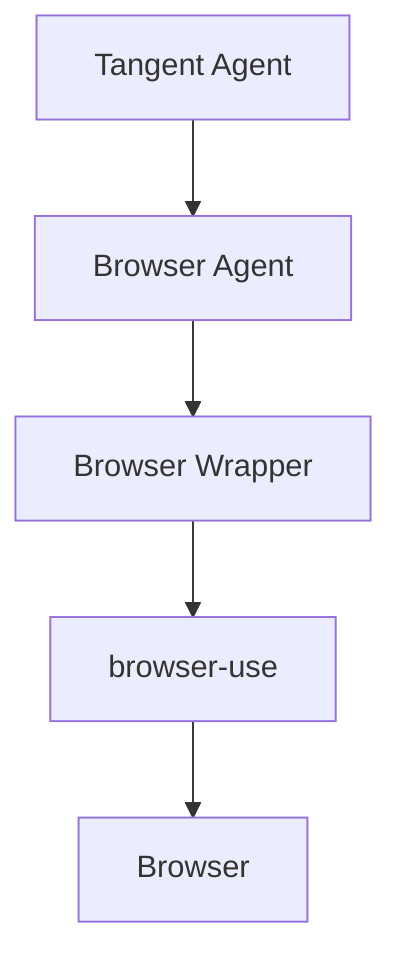

# Tangent Browser Integration: Complete Technical Documentation

## Table of Contents
1. [Overview](#overview)
2. [Architecture](#architecture)
3. [Implementation Details](#implementation-details)
4. [Usage Guide](#usage-guide)
5. [Integration Patterns](#integration-patterns)
6. [Technical Deep Dive](#technical-deep-dive)
7. [Testing & Validation](#testing--validation)
8. [Common Patterns & Best Practices](#common-patterns--best-practices)

## Overview

The Tangent Browser Integration is a sophisticated bridge between the `tangent` package and browser automation capabilities. It provides a seamless way for Tangent agents to interact with web browsers through structured, async operations.

### Key Features
- Async-first design
- Structured JSON outputs
- Sequential action execution
- State management
- Comprehensive test coverage
- Vision capabilities
- Error handling

## Architecture

### Component Hierarchy


### Directory Structure
```
tangent_browser/
├── wrapper/
│   ├── __init__.py
│   └── browser_wrapper.py     # Low-level browser control
├── integration/
│   ├── __init__.py
│   └── browser_agent.py       # Tangent integration layer
└── tests/
    ├── test_navigation.py     # Navigation tests
    └── test_content.py        # Content extraction tests
```

## Implementation Details

### 1. Browser Actions

#### Navigation Actions
```python
async def search_google(self, query: str) -> Structured_Result:
    """Search Google for a query."""
    return await self._execute_action("search_google", {"query": query})

async def go_to_url(self, url: str) -> Structured_Result:
    """Navigate to a specific URL."""
    return await self._execute_action("go_to_url", {"url": url})

async def go_back(self) -> Structured_Result:
    """Go back to the previous page."""
    return await self._execute_action("go_back", {})
```

#### Element Interaction
```python
async def click_element(self, index: int) -> Structured_Result:
    """Click an element by index."""
    return await self._execute_action("click_element", {"index": index})

async def input_text(self, index: int, text: str) -> Structured_Result:
    """Input text into a field."""
    return await self._execute_action("input_text", {
        "index": index,
        "text": text
    })
```

#### Tab Management
```python
async def switch_tab(self, page_id: int) -> Structured_Result:
    """Switch between tabs."""
    return await self._execute_action("switch_tab", {"page_id": page_id})

async def open_tab(self, url: str) -> Structured_Result:
    """Open a new tab with URL."""
    return await self._execute_action("open_tab", {"url": url})
```

#### Content Extraction
```python
async def extract_content(self, value: Literal['text', 'markdown', 'html']) -> Structured_Result:
    """Extract page content in specified format."""
    return await self._execute_action("extract_content", {"value": value})

async def get_dropdown_options(self, index: int) -> Structured_Result:
    """Get options from a dropdown menu."""
    return await self._execute_action("get_dropdown_options", {"index": index})
```

### 2. State Management

The browser maintains state through a structured format:
```python
class BrowserState(BaseModel):
    url: str
    tabs: List[str]
    interactive_elements: str

    @classmethod
    def from_browser_state(cls, state):
        return cls(
            url=state.url,
            tabs=[tab.url for tab in state.tabs],
            interactive_elements=state.element_tree.clickable_elements_to_string()
        )
```

### 3. Action Execution Flow

1. **Action Request**:
```python
action = {
    "action_name": "search_google",
    "parameters": {"query": "python programming"}
}
```

2. **Validation & Execution**:
```python
async def _execute_action(self, action_name: str, parameters: dict) -> Structured_Result:
    result = await self.browser.execute_action(action_name, parameters)
    return Structured_Result(
        result_overview=str(result["results"]),
        extracted_data={"browser_state": result["state"]}
    )
```

3. **Response Handling**:
```python
{
    "success": True,
    "action": {
        "name": "search_google",
        "parameters": {"query": "python programming"}
    },
    "state": {
        "url": "https://www.google.com/search?q=python+programming",
        "tabs": ["https://www.google.com/search?q=python+programming"],
        "interactive_elements": "..."
    },
    "results": ["Search completed successfully"]
}
```

## Usage Guide

### 1. Basic Usage

```python
from tangent import setup_agent
from tangent_browser import BrowserAgent

# Create a browser agent
async with BrowserAgent(
    name="BrowserBot",
    model="gpt-4o",
    headless=False
) as agent:
    # Search Google
    result = await agent.search_google("python programming")
    
    # Navigate to URL
    result = await agent.go_to_url("https://python.org")
    
    # Click element
    result = await agent.click_element(5)
```

### 2. Advanced Usage

#### With Vision Capabilities
```python
agent = BrowserAgent(
    name="VisionBot",
    model="gpt-4o",
    use_vision=True
)
```

#### Custom Browser Configuration
```python
agent = BrowserAgent(
    name="CustomBot",
    model="gpt-4o",
    browser_config={
        "headless": True,
        "viewport": {"width": 1920, "height": 1080}
    }
)
```

## Integration Patterns

### 1. Direct Integration

```python
from tangent import setup_agent
from tangent_browser import BrowserAgent

client, agent = setup_agent(
    name="BrowserBot",
    model="gpt-4o",
    instructions="You help with web browsing."
)

browser_agent = BrowserAgent(tangent_agent=agent)
```

### 2. Custom Action Integration

```python
class CustomBrowserAgent(BrowserAgent):
    async def custom_action(self) -> Structured_Result:
        return await self._execute_action("custom_action", {})
```

## Technical Deep Dive

### 1. Browser Wrapper Layer

The wrapper layer (`browser_wrapper.py`) provides the core interface to browser-use:

```python
class BrowserWrapper:
    def __init__(self, headless: bool = False):
        self.controller = Controller()
        self.browser = Browser(config=BrowserConfig(headless=headless))
        self.browser_context: Optional[BrowserContext] = None
        self.ActionModel = self.controller.registry.create_action_model()

    async def execute_action(self, action_name: str, parameters: Dict[str, Any]) -> Dict[str, Any]:
        action_model = self.ActionModel(**{action_name: parameters})
        results = await self.controller.multi_act(
            [action_model],
            self.browser_context
        )
        return self._format_results(results)
```

### 2. Integration Layer

The integration layer (`browser_agent.py`) connects to Tangent:

```python
class BrowserAgent:
    def __init__(
        self,
        name: str = "BrowserBot",
        model: str = "gpt-4o",
        headless: bool = False,
        use_vision: bool = False
    ):
        self.name = name
        self.model = model
        self.headless = headless
        self.use_vision = use_vision
        self.browser = BrowserWrapper(headless=headless)
```

## Testing & Validation

### 1. Test Structure

```python
async def test_navigation():
    async with BrowserAgent(headless=True) as agent:
        # Test search
        result = await agent.search_google("python")
        assert result.success
        
        # Test URL navigation
        result = await agent.go_to_url("https://python.org")
        assert result.success
```

### 2. Test Categories

1. **Navigation Tests**
   - Search functionality
   - URL navigation
   - Back navigation

2. **Interaction Tests**
   - Element clicking
   - Text input
   - Scrolling

3. **Tab Tests**
   - Tab creation
   - Tab switching
   - Tab management

4. **Content Tests**
   - Content extraction
   - Dropdown handling
   - Form interaction

## Common Patterns & Best Practices

### 1. Resource Management

Always use async context managers:
```python
async with BrowserAgent() as agent:
    # Operations here
    pass  # Resources automatically cleaned up
```

### 2. Error Handling

```python
try:
    result = await agent.search_google("python")
    if not result.success:
        logger.error(f"Search failed: {result.error}")
except BrowserException as e:
    logger.error(f"Browser error: {e}")
```

### 3. State Validation

```python
async def validate_state(self):
    state = await self.get_state()
    assert state.url, "URL must be present"
    assert state.tabs, "At least one tab must be open"
```

### 4. Action Chaining

```python
async def complex_workflow(self):
    # Chain multiple actions
    await self.search_google("python")
    await self.click_element(1)
    await self.extract_content("text")
```

## Conclusion

The Tangent Browser Integration provides a robust, well-structured way to add browser automation capabilities to Tangent agents. Its async-first design, comprehensive action set, and strong type safety make it both powerful and reliable.

For further assistance or contributions, please refer to the source code or open an issue on the repository.
